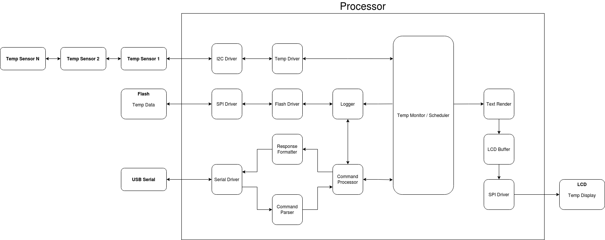
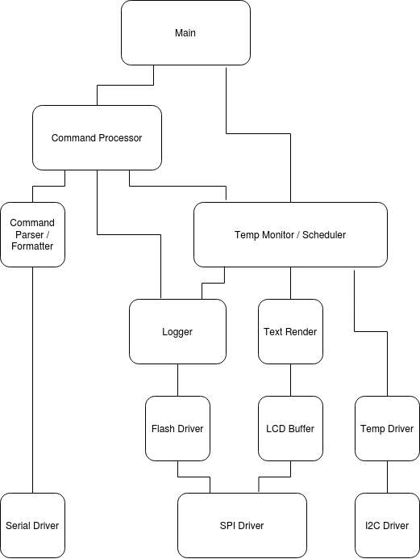
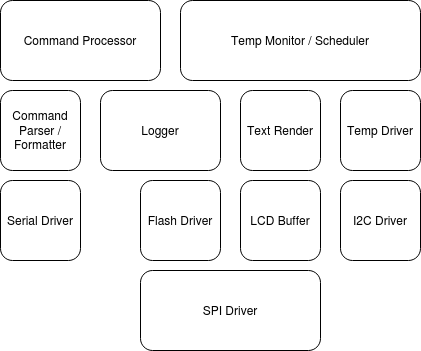

# Extensible Refrigerator Temperature Monitor & Logger (Rev 0.1)
I have an old refrigerator which doesn’t regulate temperature very well so I would like an easily extensible temperature monitor and logger.  The temperature sensors will be daisy-chainable via I2C which can be placed throughout the refrigerator.  The temperatures will be displayed on an LCD and logged to flash which can then be retrieved via a USB interface.

## Hardware / Software Block Diagram

## Hierarchy of Control Diagram

## Software Layer Diagram
